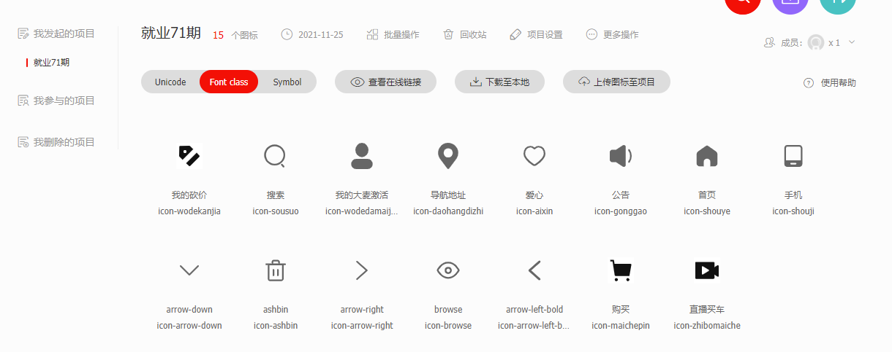
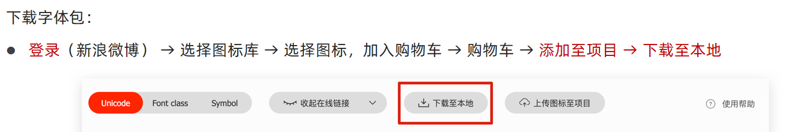
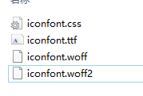
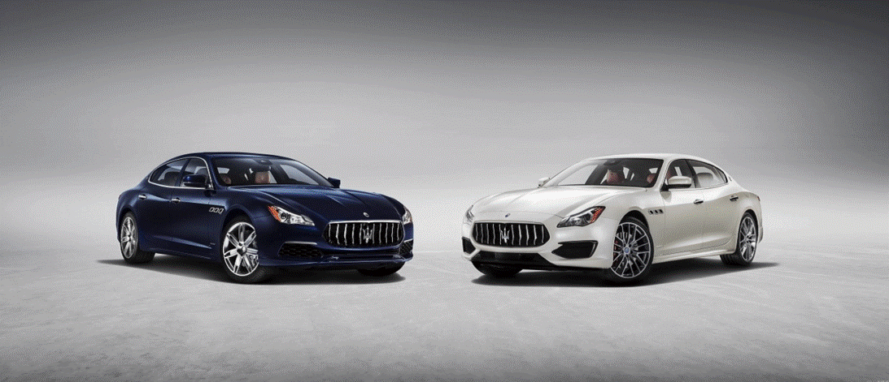

# 一、字体图标

## 下载字体图标（了解）

1. 字体图标的 **选择，上传** UI美工她们来做的，我们了解即可。

   

具体的步骤：

## 使用字体图标（重点）

### 引入相关文件（前提）

1. 复制相关的文件，到 `fonts`文件夹里面。

    

2. 引入 css 

   ~~~css
   <link rel="stylesheet" href="./fonts/iconfont.css">
   ~~~

### 使用类名引入字体图标（重点记住）

如果是一个标签来使用字体文件，可以采取2个类名的形式。（开发最常用）

~~~css

~~~

- 第一个类名 `iconfont` 目的是告诉这个盒子里面的文字是字体图标。  不是普通的文字。
- 第二个类名 `icon-daohangdizhi`， 告诉盒子到底使用哪个小图标。  

### 使用unicode编码(了解) 

也可以直接在标签内部放入一个编码

html标签

~~~css
 <strong> &#xe8ab; </strong>  
~~~

css 要指定当前标签的文字是字体图标，必须要声明。

~~~css
 strong {
      font-family: 'iconfont';
}
~~~

### 使用伪元素字体图标（记住）

~~~html

购物车

~~~

这样结构比较的清晰，省了很多的小盒子

~~~css
.car {
      width: 200px;
      height: 45px;
      border: 1px solid pink;
      text-align: center;
      line-height: 45px;
      font-family: 'iconfont';
    }
.car::before {
    content: "\e63b";

}
.car::after {
    content: "\e686";
}
~~~
>注意： 使用伪元素字体图标，一定要声明字体。  font-family: "iconfont"

## 小结

字体图标是前端工程师必须具备的知识点。 开发中， 字体图标上传，选择，都是网页美工给我们准备好了。

我们重点是下载和使用。

字体图标使用可以整体分为两大步骤：

1. 引用线上地址即可。  

   ~~~html
     <link rel="stylesheet" href="http://at.alicdn.com/t/font_3234864_h0da2uig6lr.css">
   ~~~

2. 调用。

   - 开发中最常用的是使用类名来调用，所以重点记住这个就可以了。

     ~~~html
     
     ~~~

# 二、变形 transform（2D）

变形可以改变盒子在平面内的形态（位移、旋转、缩放等等）

## 位移 translate

translate可以让盒子沿着x轴或者y轴来移动。

语法：

~~~css
transform: translate(x, y);
transform: translateX(x);
transform: translateY(y);
~~~

问题：

1. 他和margin有啥区别。
   - margin移动盒子**会**影响其余的盒子。把其他人挤走。
   - 位移translate移动盒子**不会**影响其他的盒子。不脱标。
   - 位移经常需要的场景： 
     - 比如 盒子上下移动不影响其他盒子
     - 盒子水平和垂直居中，写法简单
     - 轮播图的动画效果

>注意：
>
>移动的时候可以写百分比，如果使用的百分比，移动的是盒子**自身的宽度**

~~~css
 transform: translateX(100%);
~~~

### 应用- 盒子水平和垂直

可以让一个子盒子在父盒子里面水平和垂直居中。

~~~css
.inner {
      position: absolute;
      top: 50%;
      left: 50%;
      width: 100px;
      height: 100px;
      background-color: skyblue;
      transform: translate(-50%, -50%);
    }

    /* .inner {
      position: absolute;
      top: 0;
      left: 0;
      right: 0;
      bottom: 0;
      margin: auto;
      width: 200px;
      height: 200px;
      background-color: skyblue;
    } */
~~~

> 作业：  请同学们自己整理，实现一个子盒子，在父盒子里面水平居中和垂直居中有哪些方法？ 整理成笔记，做好写一篇博客文章。

### 开门大吉案例

效果：

~~~html
<!DOCTYPE html>
<html lang="en">

<head>
  <meta charset="UTF-8">
  <meta http-equiv="X-UA-Compatible" content="IE=edge">
  <meta name="viewport" content="width=device-width, initial-scale=1.0">
  <title>Document</title>
  
</head>

<body>
  

</body>

</html>
~~~

## 旋转 rotate

旋转可以让盒子旋转角度。 

语法：

~~~css
transform: rotate(45deg);    一定写单位
~~~

> 如果是正度数，则是顺时针旋转
>
> 如果是负度数，则是逆时针旋转

### 设置中心点  transform-origin

 /* 设置旋转的中心点位置 */

   ~~~css
  transform-origin: right bottom;
   ~~~

### 多形态变形小技巧

1. 如果需要移动，也需要旋转，则一定先写**移动**，后写旋转, css属性书写顺序影响代码执行。

   ~~~css
    transform: translate(-50%, -50%) rotate(360deg);
   ~~~

2. 注意，多个值之前用 空格隔开。

## 缩放 scale

语法：

~~~css
transform: scale(1.2)；
~~~

它比这宽度和高度最大的`优势`：  他是用中心点来进行缩放的，同样他**不会**影响其他的盒子。

案例：

和平精英

# 三、渐变

## 线性渐变

基本语法：

~~~css
background-image: linear-gradient(rgba(0, 0, 0, 0), rgba(0, 0, 0, .5))
~~~

# 四、今日单词

| 单词      | 说明        | 实例                      |
| --------- | ----------- | ------------------------- |
| transform | 变形 、转换 |                           |
| rotate    | 旋转        | transform: rotate(180deg) |
|           |             |                           |
|           |             |                           |

