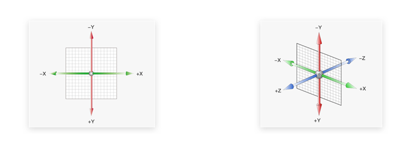

# 一、空间转换 3D

## 3D坐标系

3D 坐标系比2D 多了一个Z轴。

>**一定要记住3个坐标轴取值的正反：**
>
>- X 轴 往右越大，是正值， 否则反之
>- Y 轴 往下越大，是正值，否则反之
>- Z轴  （指向我们）越大，是正值，否则反之   

## 3D位移

有完整写法：

~~~css
 transform: translate3d(x, y, z);
~~~

只不过在很多情况下，我们经常喜欢分开写：

~~~css
transform: translateX(100px);
transform: translateY(100px);
transform: translateZ(100px);
~~~

## 透视

透视的作用： 空间转换时，为元素添加近大远小、近实远虚的视觉效果

语法:

~~~css
 perspective: 800px;
~~~

**透视注意事项：**

1. 取值范围经常在 800px ~  1200px 之间。

2. 一定给**父亲**添加

3. 透视距离也称为视距，所谓的视距就是人的眼睛到屏幕的距离。

   - 其中 d 为透视的距离
   - z 是 `translateZ` 的距离， 这个距离靠近我们，盒子越大

   

## 3D旋转

有了透视的加持，我们3d旋转效果会比较明显。

### rotateX 

类似单杠旋转。

 

> 注意：默认的旋转中心在盒子的中心位置。

~~~css
 body {
     /* 父级添加透视 */
     perspective: 400px;
}

img {
    transition: all 1s;
}

img:hover {
    transform: rotateX(360deg);
}
~~~

效果展示：

 

### rotateY 

类似钢管舞。

 

~~~css
body {
    perspective: 400px;
}

img {
    transition: all 1s;
}

img:hover {
    transform: rotateY(360deg);
}
~~~

效果如下：

 

## 左手法则

一定要搞清楚X轴和Y轴如何旋转的，旋转的度数是正值还是负值。

 

规则：

1. 大拇指指向X轴正向方（右）， 则四指指向的方向是旋转的方向
2. 大拇指指向Y轴正向方（下）， 则四指指向的方向是旋转的方向

## 立体呈现 

让子盒子在父盒子内有空间的展示，此时可以给**父亲**添加

~~~css
 transform-style: preserve-3d;
~~~

# 二、动画（重点）

动画最大的特点可以不用鼠标触发，自动的，反复的执行某些动画。

动画使用分为定义和调用：

1. 定义：

   ~~~css
   /* 1. 定义的动画 */
   @keyframes dance {

       from {
           transform: scale(1)
       }

       to {
           transform: scale(1.5)
       }
   }
   ~~~

   或者是

   ~~~css
    /* 1. 定义的动画 */
       @keyframes dance {

          0% {
           transform: scale(1)
         } 

         100% {
           transform: scale(1.5)
         }
       }
   ~~~

2. 调用

   ~~~css
   img {
       width: 200px;
       /* 2. 使用动画  animation: 动画名称 执行时间;   infinite 循环*/
       animation: dance .5s infinite;
   }
   ~~~

## 动画属性

1. 动画名字参照css类选择器命名
2. 动画时长和延迟时间别忘了带单位 s 
3.  **infinate**   无限循环动画（重复次数）
4.  **alternate**  为反向 就是左右来回执行动画（跑马灯）
5. **forwards**  动画结束停留在最后一帧状态， 不循环状态使用
6.  **linear**   让动画匀速执行

### 鼠标经过暂停动画

~~~css
/* 鼠标经过box，  则 ul 停止动画 */
.box:hover ul {
    animation-play-state: paused;
}
~~~

### 多组动画

~~~css
/* 我们想要2个动画一起执行  animation: 动画1, 动画2, ... 动画n */
animation: run 1s steps(12) infinite, move 5s linear forwards;
~~~

### 课后作业

https://browser.360.cn/ee/

首屏的制作。

