# 反馈

1. transition 和  animation的区别
   - transition:  属性  花费时间   速度曲线   延时时间;

     - ~~~css
       transition: width 2s ease 1s;   
       ~~~

   - animation: 动画名称   花费时间  速度曲线  延时时间   重复次数  动画方向  执行完毕的状态;

   - 过渡经常配合鼠标经过使用，只能设置起始和结束状态。

   - 动画可以自动执行，而且无限循环等。（其中 动画名称和花费时间必须要写），里面可以有很多的形态，比如 0%，  10% .... 100%
2. perspective 和  transform-style 区别
   - perspective  是透视，可以让电脑模拟 3d效果， 实现近大远小的效果。
   -  transform-style 立体呈现 可以让 子元素 里面按照设置位移，旋转，缩放，扭曲等。如果不给父元素这个属性，这里面所有的子盒子都是平面的。
   - 正常情况下： **爷爷设置perspective、父亲设置transform-style: preserve-3d、孩子们设置位移，旋转，缩放，扭曲等**。

# 移动端三天笔记

## 移动端特点

### PC端/移动端不同？

PC端

- 屏幕大，网页固定版心
- 端浏览器繁多，更多考虑兼容性问题。（布局： 浮动+定位+标准流）

移动端

- 手机屏幕小，网页宽度多数为100%，是适配手机屏幕宽度
- 移动端则基本不需要考虑兼容性问题，放心大胆使用CSS新特性

### 物理分辨率和逻辑分辨率

1. 物理分辨率：硬件所支持的，屏幕出厂就设定无法修改
2. 逻辑分辨率：软件可以达到的， 我们开发中写的是逻辑分辨率

### 视口

视口（viewport）就是浏览器显示页面内容的**屏幕区域**。

视口的分类：

1. 布局视口 。  iOS, Android基本都将这个视口分辨率设置为980px。

 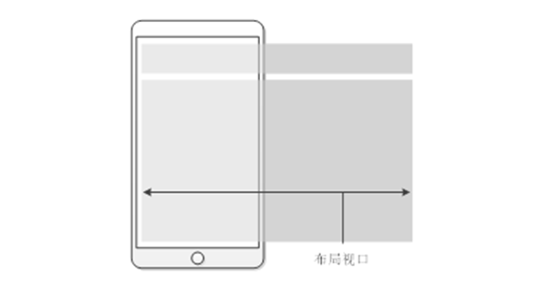

2. 视觉视口。用户正在看到的网站的区域。

 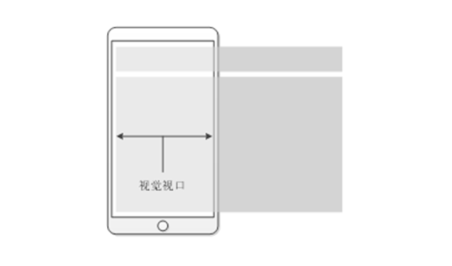

3. 理想视口。 设备有多宽，我的网页就显示有多宽

 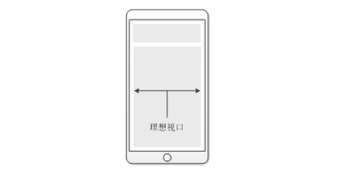

### 视口标签

有了视口标签，可以达到我们想要的理想视口。

~~~css
<meta name="viewport" content="width=device-width, initial-scale=1.0, maximum-scale=1.0, user-scalable=0">
~~~

- width=device-width：视口宽度=设备宽度
- initial-scale=1.0：初始页面缩放倍数
- maximum-scale=1.0    最大缩放倍数
- user-scalable=0    不允许用户缩放页面（移动端） 或者为 no  如果为 yes 则允许用户缩放

### 二倍图

其实实际开发中还有三倍图甚至四倍图等，多倍图，但是现在市场还是二倍图偏多，我们称为二倍图。

简单理解，二倍图存在就是为了让页面中图片更加清晰，遵循即可。

> 1. 网页美工的设计稿基本是 750px
> 2. 我们前端工程师拿到设计稿利用像素大厨选择 2X， 进行缩小一半，按照提示的单位开发即可。

 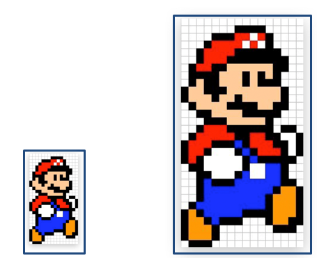

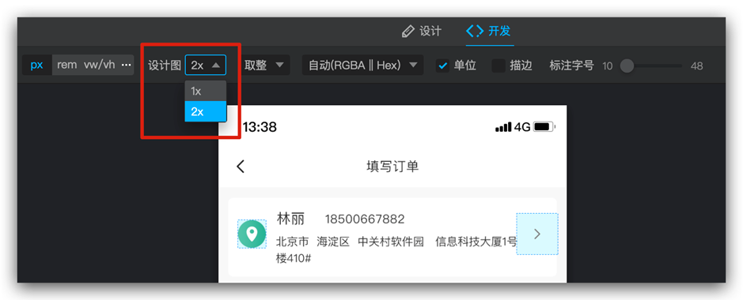

##  flex布局

flex布局极大的提高了我们布局的效率，更简单、灵活。

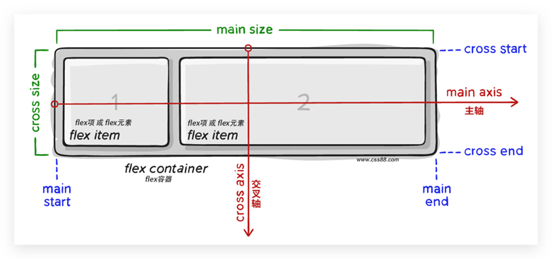

> display: flex;  一定要给**亲爸爸**加。

### 主轴对齐方式

| 属性值            | 作用                                                |
| ----------------- | --------------------------------------------------- |
| flex-start        | 默认值, 起点开始依次排列                            |
| flex-end          | 终点开始依次排列                                    |
| ` center`         | 沿主轴居中排列                                      |
| `space-around`    | 弹性盒子沿主轴均匀排列,  空白间距均分在弹性盒子两侧 |
| `space-between `  | 弹性盒子沿主轴均匀排列,  空白间距均分在相邻盒子之间 |
| ` space-evenly  ` | 弹性盒子沿主轴均匀排列,  弹性盒子与容器之间间距相等 |

重点记住标红的。如果非要问我那个常用，我只能说是  `space-between ` 

~~~css
justify-content: space-between;
~~~

显示效果：**两侧没缝隙**

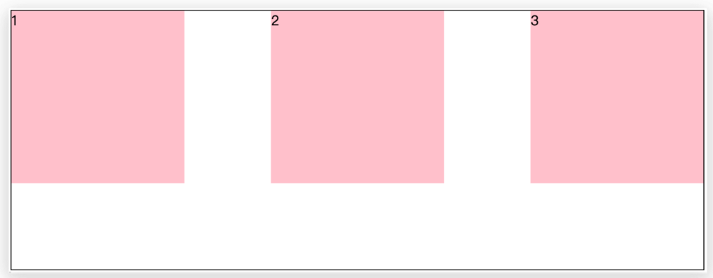

~~~css
justify-content: space-around;
~~~

效果如下：  **记住2倍**

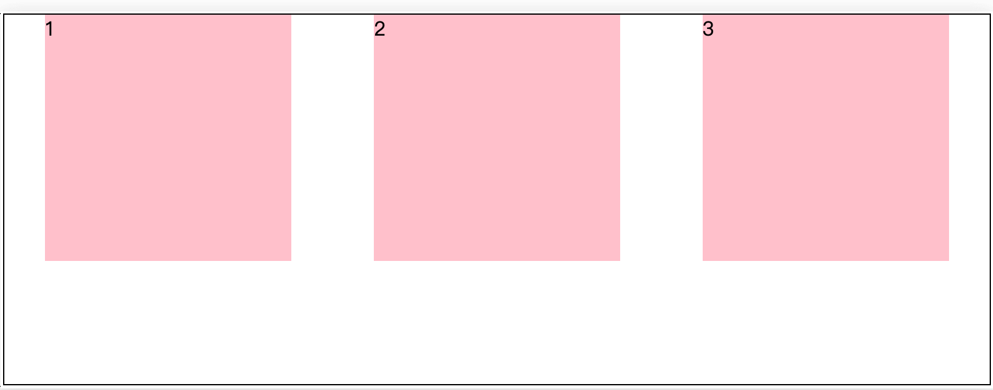

~~~css
justify-content: space-evenly;
~~~

效果如下： **记住空隙一样大**

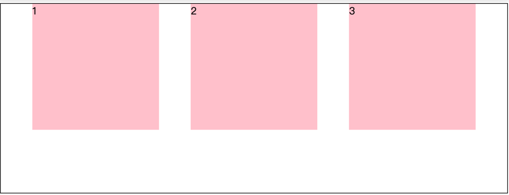

~~~css
 justify-content: center;
~~~

效果如下： **经常用于让一个盒子水平居中**

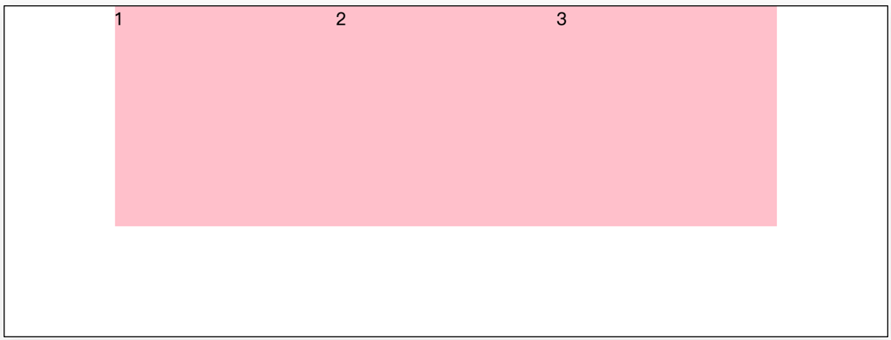

记忆：

1. 两侧没缝隙是 between
2. 缝隙一样大是 evenly
3. 2倍缝隙是 around

**小技巧：**

 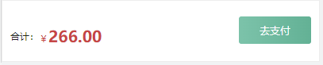

见到这个效果，最简单的做法就是： 给大盒一个 左右的padding， 然后在加 `justify-content: space-between`

### 侧轴对齐方式

| 属性值     | 作用                                         |
| ---------- | -------------------------------------------- |
| flex-start | 起点开始依次排列                             |
| flex-end   | 终点开始依次排列                             |
| `center  ` | 沿侧轴居中排列                               |
| stretch    | 默认效果, 弹性盒子沿着侧轴线被拉伸至铺满容器 |

重点记住center ，可以让元素垂直居中。

~~~css
align-items: center;
~~~

我们可以通过flex让一个子盒子水平和垂直居中。

 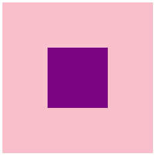

~~~css
.father {
    width: 500px;
    height: 500px;
    background-color: pink;
    /* 设置为flex布局 */
    display: flex;
    /* 主轴水平居中 */
    justify-content: center;
    /* 侧轴垂直居中 */
    align-items: center;
}

.son {
    width: 200px;
    height: 200px;
    background-color: purple;
}
~~~

### 伸缩比

把父盒子分为若干份数，每个子盒子各占几份。

>flex:1; 一定给子盒子加
>
>分配父级剩余的空间

语法：

~~~css
flex: 1;
~~~

比如有一个父盒子里面有三个子盒子，每个子盒子写 flex：1；  此时每个子盒子各占三分之一。

~~~css
.father {
    display: flex;
    height: 300px;
    background-color: pink;
}

.father div {
    /* 每个孩子各占1份 */
    flex: 1;
    /* 默认子盒子和父亲一样高 */
    background: purple;
}
~~~

html 结构

~~~html

    
1

    
2

    
3

~~~

显示效果：

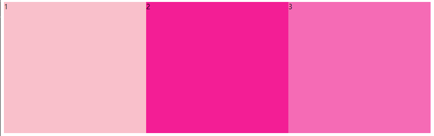

>1. 一定要给子盒子添加。
>2. 子盒子默认高度会和父盒子一样高。（前提是不给高度）

### 圣杯布局

所谓的圣杯布局就是左右两边大小固定不变，中间宽度自适应。

一般这种布局方式适用于各种移动端顶部搜索部分，这是最常见的，如京东手机版主页面顶部搜索

核心思路：

- 两侧盒子写固定大小
- 中间盒子 flex: 1;  占满剩余空间

~~~css
.top {
    display: flex;
    justify-content: c;
}

.top div:first-child {
    width: 50px;
    height: 50px;
    background-color: red;
}

.top div:last-child {
    width: 50px;
    height: 50px;
    background-color: red;
}

.top div:nth-child(2) {
    flex: 1;
    height: 50px;
    background-color: pink;
}
~~~

****

>注意：中间flex: 1;     和 width 有冲突。  **优先**执行 flex：1；

### 小结

1. 在flex眼中，标签不再分类。
   - 简单说就是没有块级元素，行内元素和行内块元素
   - 任何一个元素都可以直接给宽度和高度一行显示

2. Flex不存在脱标的情况：也就是基本淘汰了浮动，更不用清除浮动

3. 当然存在兼容性问题，如果不考虑兼容性可以大量使用，如果是移动端则不用考虑直接flex

   <https://caniuse.com/>   可以查看兼容性

