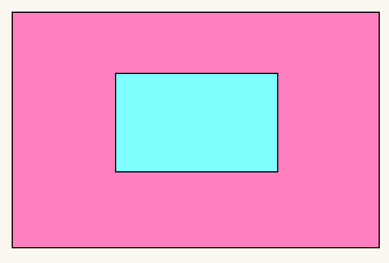

# 第五天笔记

## 适配方案

移动端的适配方案：

1.  flex + rem单位   做适配效果  （比如淘宝和小米移动端） 当前市场最多       
2.  flex + viewport  width /vh单位  做适配效果  （比如 B站移动端 ） 新兴，马上的一个趋势

>让flex做布局（盒子摆放），让rem或者vw/vh 实现网页元素的尺寸（宽度和高度）适配屏幕

## rem 适配

### rem 单位

rem 是一个相对单位，1rem 就是 html 文字的大小

比如

~~~css
html {
    font-size: 35px;
}
~~~

则此时  1rem 就是 35像素。

### 媒体查询（了解）

媒体查询 mediaquery  可以自动检测视口的宽度。

媒体查询一个非常大的作用是：`根据屏幕宽度修改html文字大小`。

> 使用媒体查询, 根据不同的视口宽度, 设置不同的根字号 ，就完成了适配

**语法：**

~~~css

@media (width:375px) {
    html {
        font-size: 40px;
    }
}

@media (width:320px) {
    html {
        font-size: 30px;
    }
}
~~~

综合：

~~~css

@media (width:375px) {
    html {
        font-size: 37.5px;
    }
}
@media (width:414px) {
    html {
        font-size: 41.4px;
    }
}

.box {
    width: 5rem;
    height: 5rem;
    background-color: pink;
}
~~~

>通过媒体查询，检测不同的视口宽度，设定不同的html文字大小，元素设置rem单位后，可以达到元素适配效果

### flexible.js 

媒体查询写起来超级麻烦，而且检测不够精确，因此我们使用 flexible.js 这个 js文件，通过js 实时检测屏幕窗口的变化实现检测视口宽度。

这个也是值得提倡使用的一种方式。

>有了这个js文件，可以帮我们自动**检测屏幕宽度**，**自动修改html文字大小**，这样就可以让盒子配合rem完成适配。

~~~html

~~~

### 如何把设计稿的px转换为rem 

问题：

1. flexible 能够修改html文字大小，修改文字大小:   当前屏幕 / 10  就是文字大小

   例如：  当前屏幕 375px，则加了 flexible之后，html文字大小为 37.5px 

2. 我们的设计稿里面元素大小是固定的吗？ 是 ， 而是 px 单位 ，但是我们开发的时候，要使用 rem 才能适配。

3. 那怎么把我们测量的px 转换为适配的rem呢？ 

   >直接使用测量的px值 /  37.5 就是 rem的值

后面我们学习vue开发的时候，所有的单位我们写  px。就足够了。  

## LESS

less 可以帮我们把px单位转换到rem单位。

Less是一个CSS预处理器, Less文件后缀是.less

扩充了 CSS 语言, 使 CSS 具备一定的逻辑性、计算能力。

### less 运算

~~~css
.box {
  width: 100px + 100;
  // 注意：单位的转换 计算的时候以第一个单位为准
  height: (100 / 37.5rem);
  // height: (100rem / 37.5);
  // height: 100px - 50;
  margin: (20px * 5) auto;
  padding: (10px / 5);
  border: 1px + 2 * 3 solid red;

}
~~~

注意点：

1. 计算以第一个单位为准， 尽量写到最后一个数字上。 比如

   ~~~css
    height: (100 / 37.5rem);
   ~~~

2. 除法比较特殊，必须添加小括号。

3. 计算别忘了先乘除后加减

###  less 嵌套

可以生成后代选择器

~~~less
.father {
    width: 500px;
    height: 500px;
    background-color: purple;
    // 孩子
    .son {
        width: 200px;
        height: 200px;
        background-color: pink;
        p {
            color: red;
        }
    }

}
~~~

生成css之后：

~~~ css
.father {
  width: 500px;
  height: 500px;
  background-color: purple;
}
.father .son {
  width: 200px;
  height: 200px;
  background-color: pink;
}
.father .son p {
  color: red;
}
~~~

>我们在写伪类和伪元素的时候，经常使用 & 来代替父元素 

~~~less
.nav {
  width: 100px;
  height: 100px;
  background-color: pink;
  &::before {
    content: '1';
  }
  &:hover::before {
    color: red;
  }
}
~~~

~~~css
.nav {
  width: 100px;
  height: 100px;
  background-color: pink;
}
.nav::before {
  content: '1';
}
.nav:hover::before {
  color: red;
}

~~~

### less 变量

变量最大的优点是： 方便使用和修改。

语法：

~~~css
@变量名: 值;
@fontSize: 16px;
~~~

~~~css

@suibian: hotpink;
body {
  background-color: @suibian;
}
p {
  background-color: @suibian;

}
div {
  color: @suibian;
}
nav {
  border: 1px solid @suibian;
}
~~~

~~~css
body {
  background-color: hotpink;
}
p {
  background-color: hotpink;
}
div {
  color: hotpink;
}
nav {
  border: 1px solid hotpink;
}
~~~

### 小练习

需求1： 使用less 完成以下效果   大盒子 father  小盒子  son

 

需求2： 鼠标经过大盒子，小盒子颜色变为 hotpink色

需求3： 请将 hotpink 颜色定义为一个变量。   @bgColor     

	-  建议： 小驼峰命名法     @backGroundColor

~~~less
// 背景颜色变量
@backGroundColor: deeppink;
// 定义边框
@bd: 3px solid green;
.father {
  width: 500px;
  height: 500px;
  background-color: pink;
  display: flex;
  justify-content: center;
  align-items: center;
  border: @bd;
  .son {
    width: 200px;
    height: 200px;
    background-color: skyblue;
    border: @bd;
  }
  // &:hover .son {
  //   background-color: hotpink;
  // }
  &:hover {
    .son {
      background-color: @backGroundColor;
    }
  }
}
~~~

### less导入

less的导入实际 是  less 文件的导入。 

~~~less
@import './变量.less';
@import url(./变量.less);
~~~

使用less导入的好处是：  减少了html页面 的 link标签数量。

### less 导出

可以使用插件来设置导出：

~~~css
  "less.compile": {
    "out": "../css/" // 设置导出css路径
  },
~~~

手动给每个less文件指定导出

>导出必须写到第一行

~~~less
// out: 路径/文件名
~~~

~~~css
// out: ./mycss/pink.css
~~~

设置导出：  当面目录下，创建一个 mycss 文件夹， 生成 一个 pink.css （做了改名）

~~~css
// out: ./mycss/
~~~

设置导出：  当面目录下，创建一个 mycss 文件夹， 生成 一个 跟less一样的文件名（原名）

### less 禁止导出

~~~less
// out: false
~~~

## 小结

我们的需求的是要做移动端适配： 页面中的元素尺寸跟随屏幕宽度等比例缩放（适当调整大小）

方案如下：

flex + rem  + flexiable.js  + less  

1. 我们移动端采取 `flex 布局`。
2. rem单位：  做移动端`适配`的。 
   - rem相对单位，跟html文字大小有关系
3. 媒体查询： `检测屏幕的视口宽度`
4. flexiable.js ：`可以根据屏幕的宽度自动修改html文字大小`
5. less:  `less让我们的css具有了计算能力`
   - less 可以让我们很方便的 把 px 转换为 rem  

