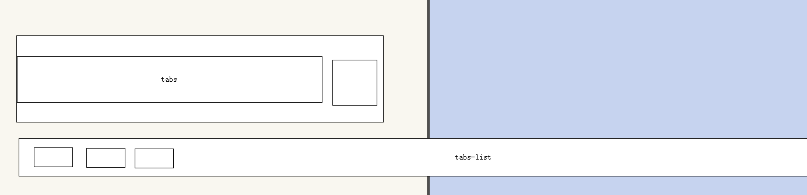

# 第六天

## vw

vw就是视口的宽度，vw 是个相对单位。  

不管在什么屏幕下， 我们把屏幕分为平均的 100等份。  

>1vw =  1 / 100 屏幕的宽度 

1vw  和    1%  

width: 1vw; 

width: 1%;

vw 和  1% 有没有区别：

1. vw 永远是以视口的宽度为准。· 在 375设计稿下， 1vw 永远是  3.75px
2. 百分比以父盒子为准。  假如父盒子是 200px，则 1% 是 2px

## px 如何转为vw

我们设计稿是 iphone 678  是  375px， vw 把屏幕划分了100等份， 则 1vw  =  3.75 px

有个盒子啊，我测量了下，他的宽度是 3.75px * 3.75px ，则 写成 vw 是多少？    1vw * 1vw

又一个盒子，宽度和高度分别是  37.5px 和 37.5px  ，则 转换为vw 是多少？  10vw * 10vw 

有一个盒子  68px  *  29px ，则我们写代码 less  vw  ？

~~~less
width: (68 / 3.75vw);
height: (29 / 3.75vw);

~~~

## tabs 布局分析

里面需要放一个 tabs-list 盒子   这个盒子放 a 

拖动的时候，拖动的是   tabs-list 

里面有很多小链接， 不允许换行。

给 tabs-list  添加 display: flex;   因为 加了弹性容器 ，里面所有的弹性盒子都会沿着主轴一行显示，不会换行。

文字不允许换行

~~~css
white-space: nowrap;
~~~

