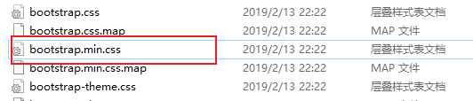
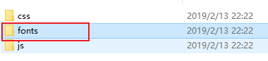
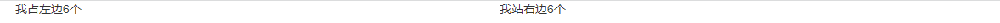
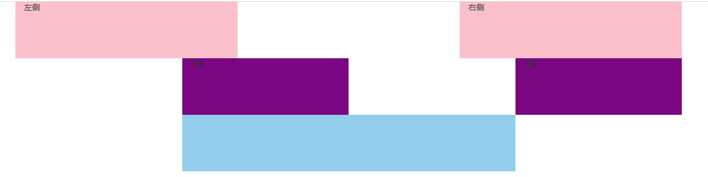
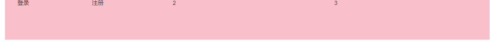

# 移动端开发第七天笔记

## 声明

今天主要的内容不是特别重要。现在开发中，响应式页面会比较少。

今天对我们来说，最大的收获是： 学会如何去使用**前端 UI 框架**。

1. 媒体查询作为了解
2. Bootstrap 框架，我们是学会怎么去用，而不是怎么去做东西，因为后面有更好的框架： 饿了吗 和 vant。

## 媒体查询

学习媒体查询的目的：

1. 了解如何使用媒体查询做响应式页面。
2. 为接下来学的 Bootstrap  做铺垫。

媒体查询会写如下代码即可：

~~~css
body {
    background-color: gray;
}

/* 大于等于768px 为粉色 */
@media (min-width: 768px) {
    body {
        background-color: pink;
    }
}

/* 大于等于992px 为蓝色 */
@media (min-width: 992px) {
    body {
        background-color: skyblue;
    }
}

/* 大于等于992px 为绿色 */
@media (min-width: 1200px) {
    body {
        background-color: green;
    }
}
~~~

### 媒体查询使用场景1-

约束移动端不要超过规定大小

~~~css
body {
    max-width: 540px;
    margin: 0 auto;
}

/* 大于等于540px 则不允许  html文字大小再改动，强制定为 54px*/
@media (min-width: 540px) {
    html {
        font-size: 54px !important;
    }
}
~~~

### 媒体查询使用场景2-

元素的显示和隐藏

~~~css
@media (max-width: 800px) {
    .box div:nth-child(2) {
        display: none;
    }

    .box div:last-child {
        width: 350px;
    }
}
~~~

### 媒体查询使用场景3

响应式原理

~~~html
<!DOCTYPE html>
<html lang="en">

<head>
  <meta charset="UTF-8">
  <meta http-equiv="X-UA-Compatible" content="IE=edge">
  <meta name="viewport" content="width=device-width, initial-scale=1.0">
  <title>Document</title>
  
</head>

<body>
  

    
1

    
2

    
3

    
4

  

</body>

</html>
~~~

## Bootstrap 

Bootstrap 是由 Twitter 公司开发维护的前端 **UI 框架**，它提供了大量编写好的 CSS 样式，允许开发者结合一定 HTML 结构及JavaScript，快速编写功能完善的网页及常见交互效果。

中文官网: <https://www.bootcss.com/>

下载安装包。

开发中，我们都是**按需导入**，简单理解，需要用到啥，我们复制那个文件，没有必要都放入，提高性能。

使用步骤：

1. 复制 css文件

    

   并且引入到html文件中

   ~~~html
   <link rel="stylesheet" href="./css/bootstrap.min.css">
   ~~~

2. 复制字体图标文件夹

    

3. 如果需要js，则复制js文件，并引入html文件中

   ~~~html
   
   ~~~

4. 使用内部预定义好的类即可。

   ~~~html
   
我的内容

   ~~~

## 栅格系统

栅格系统(gridsystems),也叫“网格系统，它就是通过一系列的行（row）与列（column）的组合创建页面布局。

简单说，栅格系统也是一种布局方式。 BootStrap 给咱们内置好了一套布局系统。

BootStrap3默认将网页分成12等份

比如，超大屏幕下我们想要一个通栏的大盒子

~~~html
 

    
我自己独占一行

  

~~~

又比如，超大屏幕下，我们想要一行左右来分

~~~html

    
我占左边6个

    
我站右边6个

~~~

超大屏下，如果一行放4个，怎么做呢？

~~~css
 

    
我占左边3个

    
我站右边3个

    
我站右边3个

    
我站右边3个

  

~~~

如果实现不同屏幕下，不同的显示个数，可以通过使用不同类名。

还是这4个盒子，如果在中等屏幕下放3个怎么做呢？

~~~css
 

    
盒子内容

    
盒子内容

    
盒子内容

    
盒子内容

  

~~~

还是这4个盒子，如果在小屏幕下放2个怎么做呢？

~~~css

    
盒子内容

    
盒子内容

    
盒子内容

    
盒子内容

  

~~~

还是这4个盒子，如果在超小屏幕下放1个怎么做呢？

~~~css
 

    
盒子内容

    
盒子内容

    
盒子内容

    
盒子内容

  

~~~

### row 类

row 可以去掉container默认的内边距

## 列偏移

列偏移 通过  col-lg-offset-*  

让盒子往右侧走，左边有几份

比如：

~~~css
    .first div {
      height: 100px;
      background-color: pink;
    }

    .second div {
      background-color: purple;
      height: 100px;
    }

    .third div {
      height: 100px;
      background-color: skyblue;
    }

~~~

~~~html
  

    

      
左侧

      
右侧

    

    

      
1侧

      
2侧

    

    

      

    

  

~~~

效果如下：

## 列嵌套

一个盒子里面可以再嵌套其他的盒子，但是站在这个盒子的角度来看，他又分为了12份。

~~~css
.container .row div {
      height: 100px;
      background-color: pink;
    }
~~~

~~~html

    

      

        
登录

        
注册

      

      
2

      
3

    

  

~~~

效果：

反馈：

1. px  pt  em   rem   vw  几个单位
   - px  绝对单位 网页布局最常用的单位， 一般用于pc端布局。  px 像素的意思。  版心是 1200px  
   - pt  点  常用于 印刷。   或者 ios 常用的单位。 我们前端基本不用。
   - em   相对单位。   1em 就是当**前的一个文字**大小。 场景：   段落首行缩进 2个字。   text-indent: 2em;
   - rem 相对单位。  相对于 **html标签** 的文字大小，跟其余标签没有任何关系。  场景： 做适配。
   - vw 可以看做是适配的终极版本。  vw也是相对单位。  vw 把屏幕划分了 100等份。 场景： 做适配。

js基础视频预习：

链接：https://pan.baidu.com/s/1oX6Zv5IQU80fvUdAoQKN-A 
提取码：8eh5 
--来自百度网盘超级会员V6的分享

